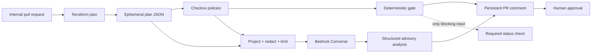

# Terraform AI Reviewer on AWS

A deterministic-first reviewer for Terraform pull requests. It turns a Terraform plan and Checkov
results into a compact risk report, asks Amazon Bedrock for additional context, and maintains one
English-language comment on the PR. The model is an adviser: only explicit policy-as-code checks
can fail the merge gate, and this repository contains no apply workflow.

The project is intentionally sized for a live technical talk. It demonstrates the security
boundaries that should survive beyond the demo without pretending to be a complete internal
developer platform.

## Architecture



The binary and JSON plans stay on the ephemeral runner. Only the sanitized review is written to
the job summary and PR. This matters because `terraform show -json` can expose sensitive values
that the terminal representation hides.

## What is included

- A Python 3.12 CLI with Pydantic contracts for the review context and final report.
- Recursive redaction based on Terraform's sensitivity trees and defensive secret-key patterns.
- Checkov plan scanning with four curated blocking checks and non-blocking visibility for all other
  failures.
- Amazon Bedrock Runtime `Converse` using validated structured output.
- An explicit fixture provider for offline tests and rehearsals. It is never selected automatically.
- A GitHub Actions workflow pinned to immutable action commits.
- A separate Terraform bootstrap for the GitHub OIDC provider and Bedrock-only IAM role.
- A safe demo configuration plus a patch that introduces correlated network, IAM, and S3 risks.

## Prerequisites

- Terraform 1.13.3
- Python 3.12–3.14
- [`uv`](https://docs.astral.sh/uv/)
- An AWS account with access to Claude Sonnet 4.6 in Amazon Bedrock for the real inference path
- An internal GitHub branch and permission to configure repository variables and branch protection

Install the locked toolchain:

```bash
uv sync --locked --all-groups
```

## Rehearse entirely offline

The committed fixtures are synthetic and contain no real credentials or infrastructure state.

```bash
make review-fixture
sed -n '1,240p' .artifacts/review.md
uv run terraform-ai-review gate --review .artifacts/review.json
```

The last command exits `1` because the fixture deliberately contains the four blocking policy
violations. Run the CLI directly when different paths are useful:

```bash
uv run terraform-ai-review review \
  --plan fixtures/tfplan.json \
  --checkov fixtures/checkov.json \
  --provider fixture \
  --fixture fixtures/bedrock-response.json \
  --config reviewer.yaml \
  --json-out .artifacts/review.json \
  --markdown-out .artifacts/review.md
```

`--provider fixture` is always explicit. A Bedrock failure never swaps in the polished fixture and
therefore cannot hide an outage during the talk.

## Generate the plan-only example

The demo provider is configured to skip account and credential validation. The scoped dummy
environment variables satisfy provider initialization; Terraform does not query AWS and nothing is
created.

```bash
make plan
make scan

uv run terraform-ai-review review \
  --plan .artifacts/tfplan.json \
  --checkov .artifacts/checkov.json \
  --provider fixture \
  --fixture fixtures/bedrock-response-safe.json \
  --config reviewer.yaml \
  --json-out .artifacts/review.json \
  --markdown-out .artifacts/review.md
```

Never copy the provider's `skip_*` switches into a production root module.

## Configure the real Bedrock path

The one-time bootstrap is deliberately isolated from the reviewed infrastructure:

```bash
cp bootstrap/terraform.tfvars.example bootstrap/terraform.tfvars
# Edit the exact GitHub OIDC subject.
terraform -chdir=bootstrap init
terraform -chdir=bootstrap plan
terraform -chdir=bootstrap apply
```

If the account already has `token.actions.githubusercontent.com` configured, set
`existing_oidc_provider_arn` rather than attempting to create a duplicate account-level provider.
The GitHub subject must be exact and end in `:pull_request`. Repositories created on or after July
15, 2026 normally include immutable owner and repository IDs, for example:

```text
repo:octo-org@123456/octo-repo@456789:pull_request
```

The resulting role can call `bedrock:InvokeModel` only for the US geographic Claude Sonnet 4.6
profile and its destination models. It has no EC2, IAM, S3, Terraform state, or other infrastructure
permissions. The default profile may route prompts through `us-east-1`, `us-east-2`, or
`us-west-2`; select a different geographic profile before use if those boundaries do not satisfy
your data-residency requirements.

Set the `reviewer_role_arn` output as the GitHub repository variable `AWS_ROLE_ARN`. The workflow
uses short-lived OIDC credentials, so no AWS access keys are stored in GitHub.

For local real-model smoke testing, first authenticate to AWS and replace `--provider fixture` with
`--provider bedrock`. Override `AWS_REGION` and `BEDROCK_MODEL_ID` when needed.

## Run the talk scenario

Start from the safe `demo/terraform` configuration on the default branch, then create the risky PR:

```bash
git switch -c demo/risky-change
make demo-change
git add demo/terraform/main.tf
git commit -m "demo: relax application infrastructure controls"
git push -u origin demo/risky-change
```

The patch opens SSH to the internet, expands the application policy to `Action = "*"` and
`Resource = "*"`, and removes bucket versioning and Public Access Block. The PR should receive one
comment whose deterministic status is `BLOCK`, followed by Bedrock's advisory explanation of the
combined blast radius.

Fixing the Terraform and pushing again updates the same marker-based comment; it does not create a
new comment. Configure branch protection to require `Deterministic Terraform gate` and at least one
human approval.

## Policy and failure semantics

| Check | Demo policy | Severity | Blocks |
| --- | --- | --- | --- |
| `CKV_AWS_24` | SSH open to the world | Critical | Yes |
| `CKV_AWS_355` | Restrictable IAM actions use wildcard resources | Critical | Yes |
| `CKV_AWS_21` | S3 versioning disabled | High | Yes |
| `CKV2_AWS_6` | S3 Public Access Block missing | High | Yes |
| Any other Checkov failure | Visible security finding | Medium | No |

The mapping lives in `reviewer.yaml`; it does not depend on a hosted Checkov severity service.
Checkov runs in soft-fail mode so the full explanation can be rendered before the CLI enforces the
mapping.

- Terraform, plan parsing, Checkov parsing, or comment publication errors fail the workflow.
- A Bedrock timeout, refusal, malformed response, or unavailable model produces an explicit
  `AI analysis unavailable` section and does not change the deterministic result.
- A no-change plan skips model invocation.
- Forked PRs skip the privileged job. Supporting untrusted forks requires a separate threat model;
  do not change this workflow to `pull_request_target` and execute fork code.

## Data handling and limits

Bedrock receives only resource addresses, actions, changed attribute paths, bounded before/after
values, plan counts, and normalized Checkov metadata. Code blocks from Checkov and the rest of the
Terraform plan are excluded. Terraform sensitivity maps are applied before flattening, then keys
such as `password`, `secret`, `token`, `private_key`, `access_key`, and `connection_string` are
redacted defensively.

The defaults cap model input at 100 resources, 20 changed attributes per resource, 300 characters
per scalar value, 50 deterministic findings, and 10 AI findings. Truncation is recorded in
`review.json`. The PR renderer stays below GitHub's comment limit and escapes model-controlled HTML
and table delimiters.

Model invocation incurs normal Amazon Bedrock charges. The reviewer uses temperature `0`, a maximum
of 3,000 output tokens, and the standard service tier. Check current regional availability, model
terms, and pricing before presenting or adopting the example.

## Production adaptations

This demo plans an isolated local-backend configuration from an empty state. A production adopter
must separately design read-only access to its actual backend and provider APIs, workspace or stack
discovery, module authentication, policy ownership, exception expiry, audit retention, and model
data residency. Those permissions must not be added to the Bedrock-only demo role by default.

Keep the core invariant: policy-as-code and human approval control deployment; model output supplies
prioritization and explanation only.

## Development checks

```bash
make test
make lint
make fmt-check
make terraform-validate
```
